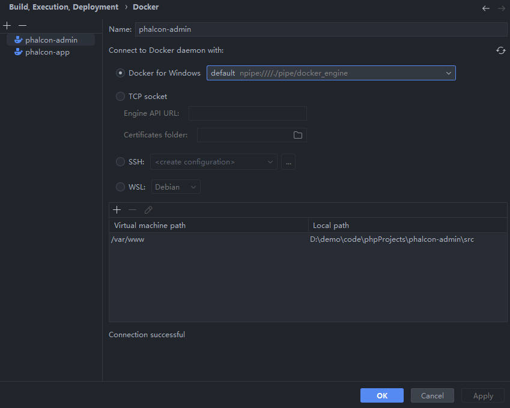
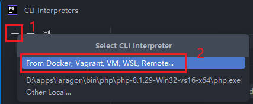
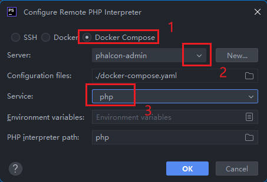
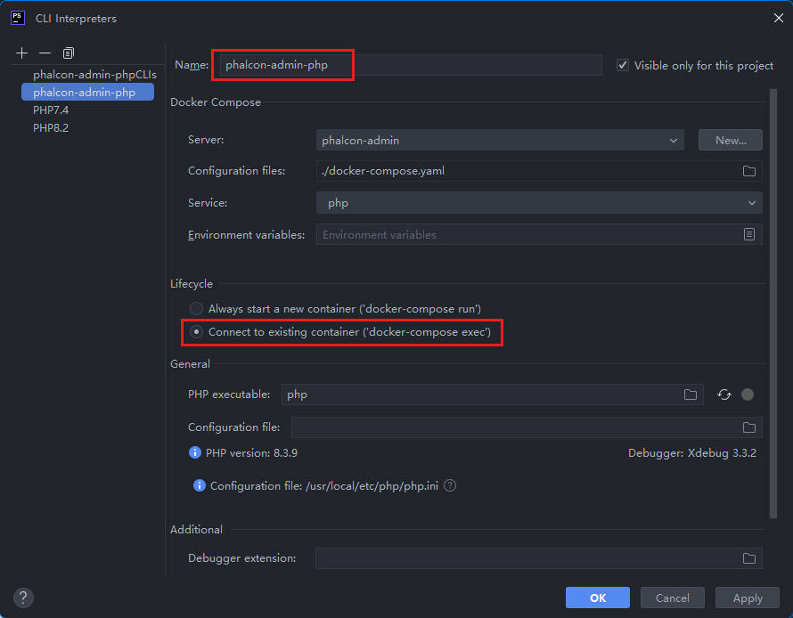

如果项目运行在 `docker` 环境中，为了方便开发和测试，需要在 `PHPStorm` 进行一些配置

#### 准备

确保 `PHPStorm` 开启了以下插件

* PHP Remote Interpreter
* PHP Docker
* FTP/SFTP/WebDAV Connectivity
* Docker

#### Build,Execution,Deployment > Docker

添加一个 `docker` 设置

```
Name                : phalcon-admin ; whatever you like
Docker for Windows  : default `npipe:////./pipe/docker_engine`

Virtual machine path            Local path
/var/www                        /本地项目/src
```




#### PHP

添加一个新的 CLI

1. 在 PHP 视图中，点击 `CLI Interpreter` 右边的 `...` 按钮
    * 在弹出的 `Select CLI Interpreter` 弹窗中，点击 `From Docker, Vagrant, VM, WSL, Remote...` 选项，如果你没有看到这一选项，请检查是否安装/开启了需要的插件。
    
    

2. `Configure Remote PHP Interpreter`
    ```
    选择 Docker Compose
    Server  : phalcon-admin
    Service : php
    ```

    

    点击 `OK` 按钮

3. 修改 `CLI Interpreters` 名称
    * 默认的名称为 `php`，将其修改为新的名称，比如 `phalcon-admin-php`;
    * Lifecycle: 选择 `Connect to existing container`;
    * 
    
    基本配置已经完成，现在我们可以准备配置 `Debug` 和 `PHPUnit` 了