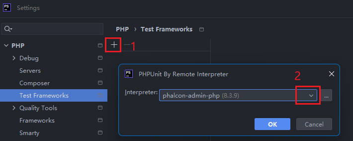
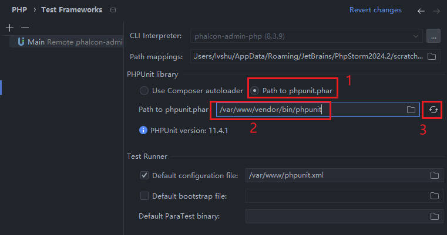
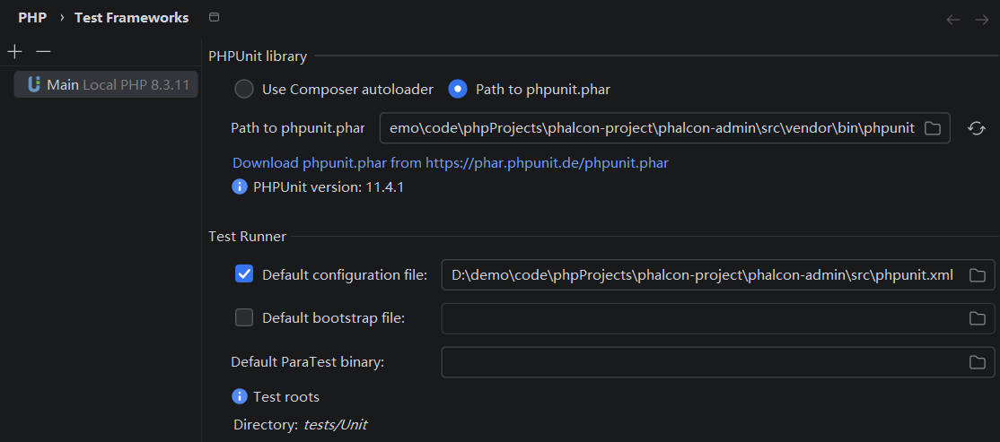
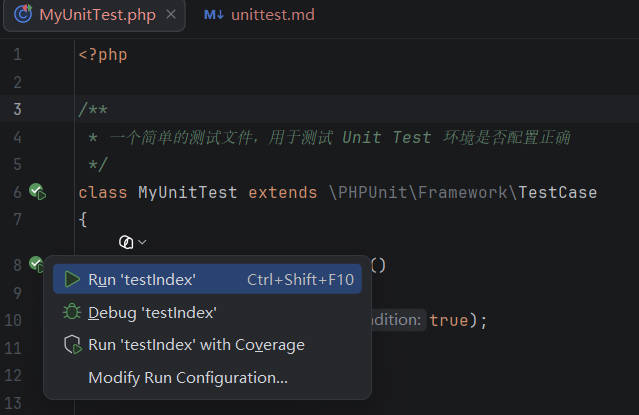
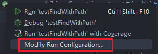
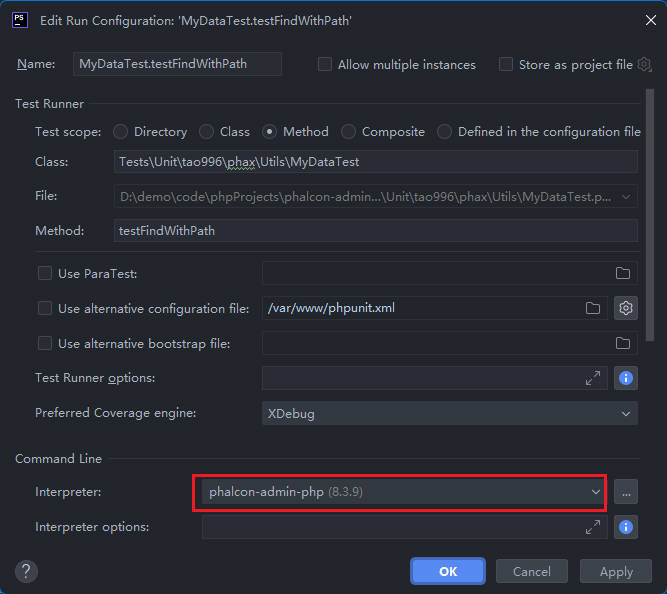
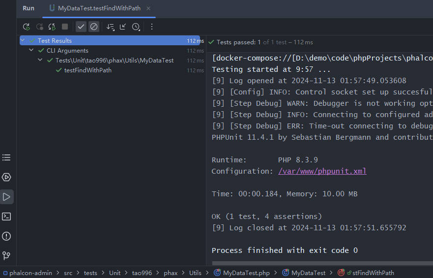

复制一份 `cp src/phpunit.example.xml phpunit.xml`

## Docker 开发

注意：如果是运行在 `docker` 环境下，请确保已经按照 [docker 环境](docker.md) 设置好配置。

* 安装好相关的插件
* 添加了 PHP CLI

进入服务控制台，执行 `composer.phar install` 安装以下开发组件

```
# 需要进入 php 服务控制台
docker-compose exec php sh // 也可能是 docker compose 取决于你的系统

# /var/www/composer.json 中依赖内容
"require-dev": {
    "php": "^8.3",
    "phpunit/phpunit": "^11.2",
    "mockery/mockery": "^1.6"
}
```

打开 PHPStorm Setting, 进入 `PHP > Test Frameworks`

1. 添加一个新的测试框架 `PHPUnit By Remote Interpreter`
    * 
2. Setting
    * 注意：你需要安装好 `require-dev`，填写路径 `/var/www/vendor/bin/phpunit`
    * 

## 主机开发

如果是在主机下开发，则比较简单

`composer.json` 位于 `src/` 目录下，直接下面命令

```
cd src
composer install
```

打开 `PHP > Test Frameworks`，默认 `PHPUnit Library` 会自动使用 `Use Composer autoloader`，
并自动定位到 `src\vendor\autoload.php`。或者自己手动使用下面的配置



## Test Result

### 简单测试


直接测试 `src/MyUnitTest.php` 内的方法



### 项目测试

选择任意一个测试文件，如 `src/tests/Unit/tao996/phax/Utils/MyDataTest.php`，在 IDE上点击执行，查看效果

1. 点击待测试方法左边的绿色图标，从弹出的窗口中选择 `Modify Run Configuration`

    

2. 在 `Command Line > Interpreter` 中选择之前创建的 CLI

    

3. 查看测试结果

    


## 常见问题

* `Allowed memory size of 16777216 bytes exhausted (tried to allocate 274432 bytes)`

默认 `php.example.ini` 中 `memory_limit = 16M`，可以修改为 `memory_limit = 256M`