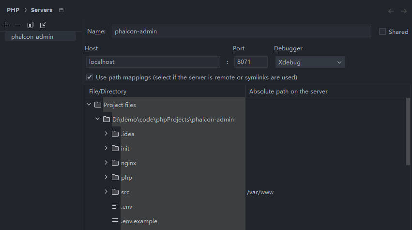
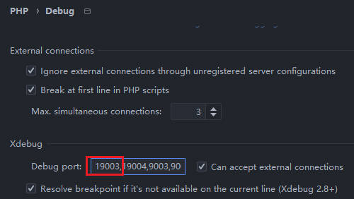
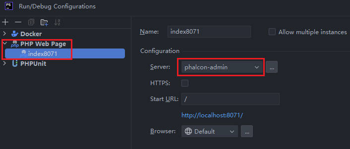
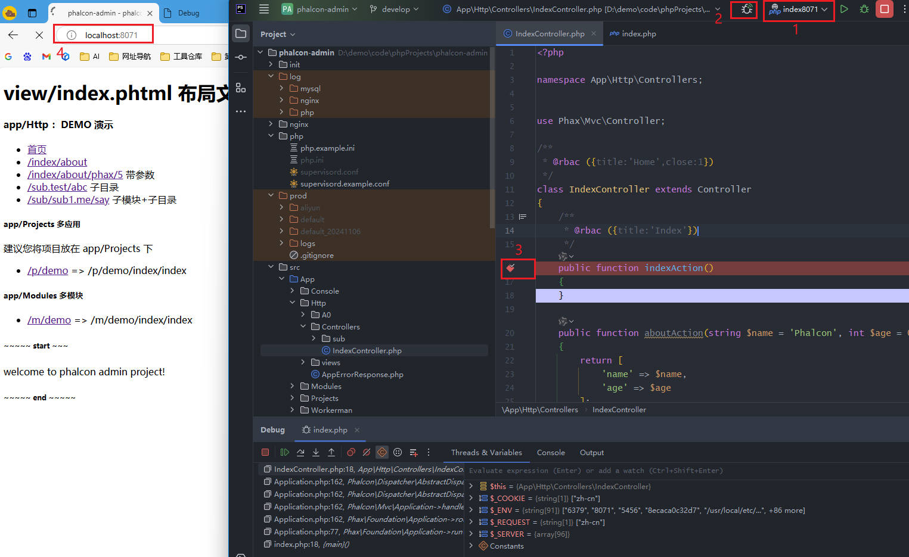

## Xdebug 本机配置
```
[xdebug]
zend_extension = "D:/apps/laragon/bin/php/php-8.3.11-Win32-vs16-x64/ext/php_xdebug.dll"
xdebug.mode = debug
xdebug.client_host = 127.0.0.1

; 1. 修改为推荐的空闲端口
xdebug.client_port = 51712

; 2. 强烈建议改为 trigger（按需触发）
; 这样只有当你开启浏览器插件或传入?XDEBUG_SESSION 时才激活调试，
; 不会每个普通请求都去连接调试器，性能会好很多
xdebug.start_with_request = trigger
xdebug.idekey = xdebug
; 调试日志（仅在排查连接问题时开启，平时注释掉）
;xdebug.log = "D:\apps\laragon\tmp\xdebug\xdebug.log"
;xdebug.log_level = 0
```

1. 确认 PHP 解释器（一次性）
    
    `Settings → PHP`，CLI Interpreter 选择当前服务的 PHP（`D:\apps\laragon\bin\php\php-8.3.33-Win32-vs16-x64\php.exe`）。PhpStorm 会读取同一个 php.ini，右侧应能看到 Xdebug 模块和 51712 端口。

2. 配置 Debug 端口

    `Settings → PHP → Debug`：
    * Xdebug 的 Debug port 填 `51712`（移除旧的 9003 之类的，必须等于 php.ini 里的 `xdebug.client_port`）；
    * 勾选 "Break at first line in PHP scripts" 可选（建议先不勾，避免断在入口文件）。

3. 配置服务器与路径映射
   
    `Settings → PHP → Servers`，新增：
    * Name：`phalcon-admin`（随意），Host `127.0.0.1`，Port `8071`，Debugger `Xdebug`；
    * Path mapping：项目根 `D:\xxx\phalcon-admin` 映射到同路径。你的 docroot 就是本机真实目录，通常不映射也能断，但显式设置可避免断点文件对不上。

4. 开始调试（两种触发方式，选一）

方式 A：PHP Web Page 运行配置（推荐，最省事）

1. `Run → Edit Configurations → + → PHP Web Page`，Server 选上一步的 `phalcon-admin`，Start URL 填 /（或某个具体路由）。
2. 点工具栏的 Debug（小虫子）按钮——PhpStorm 会自动开始监听并在请求 URL 后附加 XDEBUG_SESSION，命中断点后停在 IDE 里。
3. 之后在浏览器里继续正常点击页面，同一个会话内 Xdebug 会持续连接（PhpStorm 会写 XDEBUG_SESSION cookie）。

方式 B：手动监听 + 浏览器触发

1. `Run → Start Listening for PHP Debug Connections`（电话图标）。
2. 浏览器访问时任意一种方式触发： URL 加参数：http://127.0.0.1:8071/?XDEBUG_SESSION=1（Xdebug 3 不校验值，有这个参数即触发）； 或装浏览器扩展（Xdebug Helper，Chrome/Edge/Firefox 都有），IDE key 随意，点一下开启。

## Xdebug in Docker

注意：如果是运行在 `docker` 环境下，请确保已经按照 [docker 环境](docker.md) 设置好配置。

默认配置已经在 `php/php.example.ini` 中存在，不建议直接修改 `php.example.ini` 文件，可以复制一份修改名称为 `php.ini`（注意修改 `docker-compose.yaml` 中 php service 对应的配置）

```ini
[xdebug]
; 在 authus/phalcon:5.13.0 中不需要开启
;zend_extension=xdebug.so
xdebug.mode=debug,develop
xdebug.discover_client_host=0
xdebug.idekey=docker
xdebug.client_port = 19003
xdebug.client_host=host.docker.internal
; 容器内直连宿主机 PhpStorm，无需 DBGp Proxy
xdebug.start_with_request=trigger
xdebug.log_level = 0
```

如果你本地机器已经安装了 `xdebug` 那么就不能继续使用 `9003` 端口了

修改 `docker-compose.yaml` 中 `php` 服务的配置（可参考 `docker-compose.example.yaml` 文件）

记住以下信息

* `xdebug.client_port` 修改为 `19003`
* `xdebug.idekey` 修改为 `docker` 
* `serverName` 修改为 `phalcon-admin`,

下面的 `PHPStorm Setting` 将使用到这些信息

### PHPStorm Setting

* PHP > Servers

创建一个新的服务，名称为 `phalcon-admin`（必须与上面的 `serverName` 属性值保持一致），配置如下

```
Host    : localhost
Port    : 8071
Debugger: Xdebug

[checked]Use path mappings...

File/Director       Absolute path on the server
...
    >src             /var/www
```



* PHP > Debug

将我们 `xdebug.client_port` 设置的 `19003` 添加到 `Debug port` 中.



* Run/Debug Configuration

添加运行配置，类型为 `PHP Web Page`, 服务选择 `phalcon-admin`，我们将其命名为 `index8071`



### Test Result

1. 选择刚刚创建的 `index8071`
2. 打开连接监听开关
3. 在待访问页面打上断点（示例为 `src/App/Http/Controllers/IndexController.php`，即默认首页）
4. 在浏览器中访问默认的首页 http://localhost:8071



如果配置成功，那么我们就可以在 IDE Debug 区域看到调试结果


### 常见问题


* `9003` is busy，`Server name` 显示为空，`port` 总是 80

移除 xdebug 配置中的 9003，可能被本地 php 环境占用了

* 点击 debug 后自动打开链接 `http://localhost:8071` 但是断点没有中断

IDE 配置 `PHP > Servers` 中的 `Name`与 `docker-compose.yaml` 中 php 服务的 `serverName` 不一致

* 在浏览器中 debug 正常，在其它 api 工具之类的不正常，总会自动跳过断点；

原因暂未知

1. 不知道具体原因，直接删除项目下的 `.idea` 目录，然后重新打开，再配置
2. 更换 image, 使用其它版本的 xdebug
3. 更换 PHPStorm

* 断点无效

```
src\App\Modules\tao\Controllers\AuthController.php:129
File path is not mapped to any file path on server. Edit path mappings to fix the problem.
```